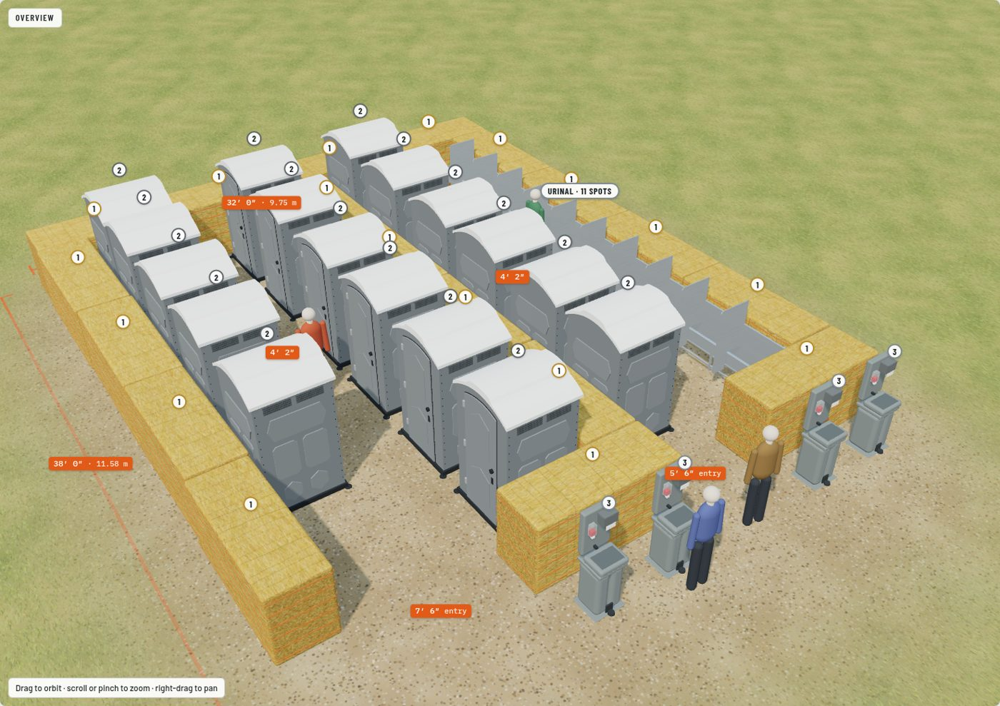
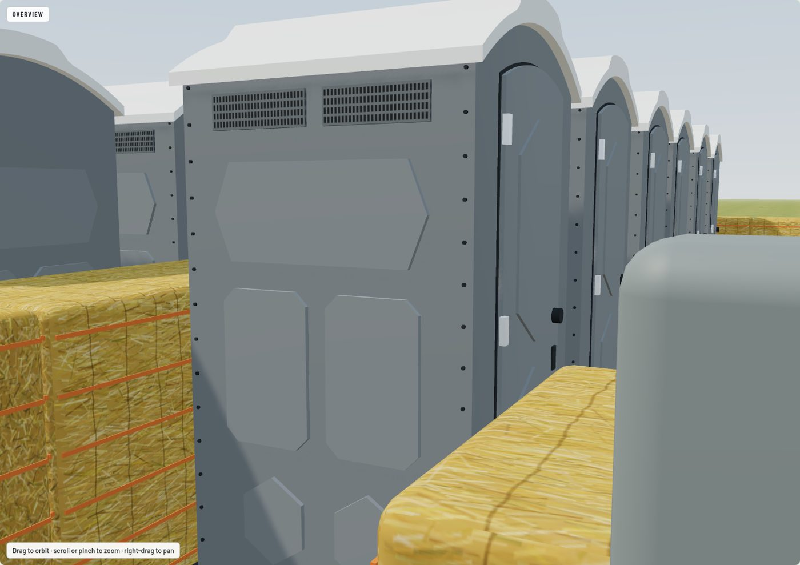
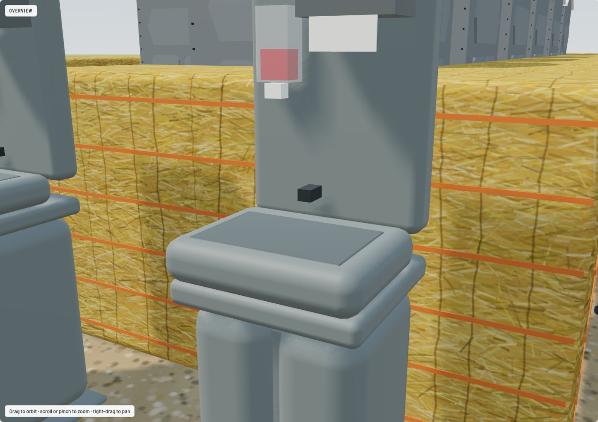
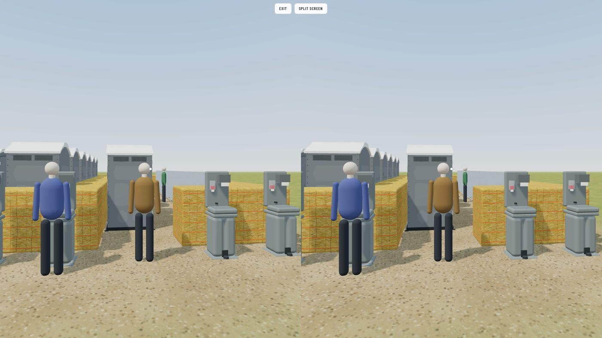

# Potty Floor Plan

Interactive 3D model of an event restroom area, rebuilt at real size from a hand-drawn plan.

**Open it: https://alejandrothiessen.github.io/potty-floor-plan/**

## What's in it

| Sketch # | Item | Count | Modeled as |
| --- | --- | --- | --- |
| 1 | Big square bales, 3 × 4 × 8 ft | 18 | Four layouts: on its side (4 ft walls), two high on its side (8 ft), lying flat (3 ft), two high lying flat (6 ft) |
| 2 | Portable toilets | 17 | Gray cabins as photographed, 47 × 47 × 91 in (PolyJohn Fleet size), rows of 5, 6 and 6, doors to the aisles |
| — | Stainless trough urinal | 1 | 31.5 ft run (four 2.4 m sections), 10 privacy dividers, 11 spots |
| 3 | Hand-wash stations | 4 | Single-sink stands as photographed, 62 × 18 × 20 in (PolyJohn Encore size), foot pump |

## Using it

- **Views:** Overview, Plan, Entrance, Toilet aisle, Urinal aisle, or Walk (W A S D or arrow keys; on a phone, the on-screen pad).
- **Phone VR walk-through:** open the link on a phone, turn it sideways and tap the button. Split screen is for a
  cardboard viewer; turn it off to just hold the phone up. Hold the screen to walk. Safari asks to use motion: tap Allow.
- **Show:** sketch numbers, measurements, door swings, people for scale.
- **Does it fit?** recalculates the aisle widths for each bale layout.

| Toilet | Wash stand | Phone VR |
| --- | --- | --- |
|  |  |  |

## Fit check

| | On its side (1 or 2 high) | Lying flat (1 or 2 high) |
| --- | --- | --- |
| Toilet aisle, door to door | 4′ 2″ (1.27 m), tight | 2′ 8″ (0.81 m), too narrow |
| Urinal aisle, toilet doors to divider tips | 4′ 2″ (1.28 m), tight | 2′ 8″ (0.83 m), too narrow |
| Ways in, left / right | 7′ 6″ / 5′ 6″ | 7′ 0″ / 5′ 0″ |
| Footprint, bales only | 32 × 38 ft (9.75 × 11.58 m) | 32 × 40 ft (9.75 × 12.19 m) |

A cabin door swings out about 28 in, so 5 ft between fronts leaves room to pass an open door. A fifth bale across
the back (40 ft wide) would add about 4 ft to each aisle.

## Sources

- John Deere L341 large square baler (3×4 bale size): https://www.deere.com/en/hay-forage/baling/l341-baler/
- Texas A&M AgriLife, bale weight: https://foragefax.tamu.edu/publications/2012-bale-weight-how-important-is-it/
- PolyJohn Fleet (47 × 47 × 91 in): https://www.webstaurantstore.com/polyjohn-fs3-1005-fleet-pewter-premium-portable-restroom/621FS31005.html
- Satellite Maxim 3000: https://www.satelliteindustries.com/products/maxim-3000
- PolyJohn PJN3: https://www.webstaurantstore.com/polyjohn-pjn3-1008-white-portable-restroom-with-translucent-top/621PJ31008.html
- PolyJohn Encore hand-wash station: https://www.polyjohn.com/encore
- Floor-standing stainless urinal trough: https://www.commercialwashroomsltd.co.uk/floor-standing-stainless-steel-urinal-trough-with-exposed-cistern.html
- DELABIE 130120 trough urinal and dividers: https://delabie.com/products/130120
- IBC 2021 §1210.3.2 urinal partitions: https://up.codes/s/urinal-partitions

Concept model, not a construction drawing. Equipment sizes come from the products listed; confirm them with the
rental company.
